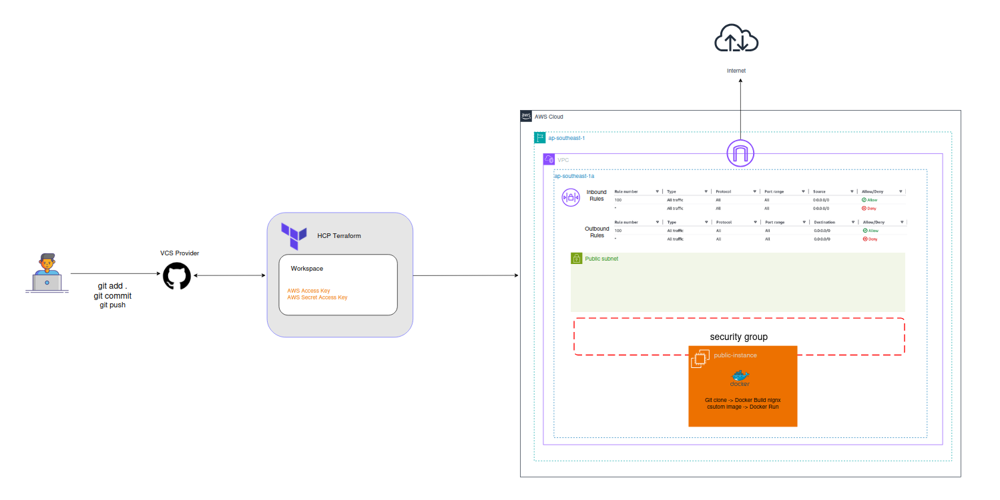

# Project Name: Hosting Web App on AWS EC2 using Terraform and Docker

## Overview

This project shows how to deploy a simple web application on AWS using **Terraform** and **Docker**.

The infrastructure is managed with Terraform and deployed using HCP Terraform with VCS integration. When code is pushed to GitHub,Terraform automatically runs plan and apply to provision AWS resources.

The infrastructure and the application code are separated into **two Git repositories**.

* Terraform creates the AWS infrastructure
* EC2 installs Docker automatically
* EC2 clones the application repository
* Docker builds a custom Nginx image
* The website is available on port 80

---

## Repositories

### 1. Infrastructure Repository (this repo)

This repository contains all Terraform code and the EC2 script.

Structure:

```
ec2-terraform-docker-infra/
├── terraform/
│   ├── aws_keypair.tf
│   ├── data.tf
│   ├── ec2.tf
│   ├── outputs.tf
│   ├── providers.tf
│   ├── security.tf
│   ├── terraform.tfvars 
│   ├── variables.tf
│   └── vpc.tf
├── scripts/
│   └── install-docker.sh
└── README.md
```

---

### 2. Application Repository

**Name:** `docker-nginx-web-app`

This repository contains the web application and Docker configuration.

Structure:

```
nginx-app/
├── index.html
└── Dockerfile
```

---

## Architecture Diagram



---


## How It Works

1. Terraform creates the VPC, subnet, route table, and EC2
2. EC2 runs `install-docker.sh` on first boot
3. Docker is installed automatically
4. The script clones the application repository
5. Docker builds a custom Nginx image
6. The container runs and serves `index.html`

---

## install-docker.sh (Summary)

The script does the following:

* Updates the system
* Installs Docker
* Starts Docker service
* Clones the application repository
* Builds a Docker image
* Runs the Nginx container on port 80

---

## How to Deploy (HCP Terraform – VCS Workflow)

This project uses HCP Terraform with VCS integration.

Deployment is fully automated:
1. Code is pushed to GitHub
2. HCP Terraform detects the change
3. Terraform plan runs automatically
4. Terraform apply runs after confirmation
There is no need to run Terraform locally.

After deployment, open the browser:

```
http://<EC2_PUBLIC_IP>
```

To avoid AWS charges, I suggest destroy the infrastructure after testing. (Optional)

```bash
terraform destroy
```